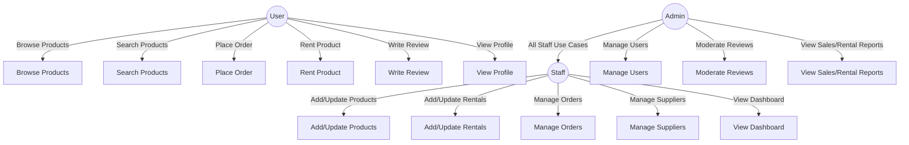
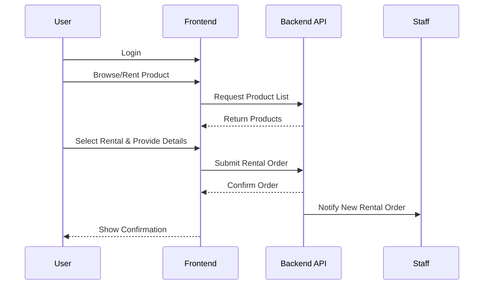
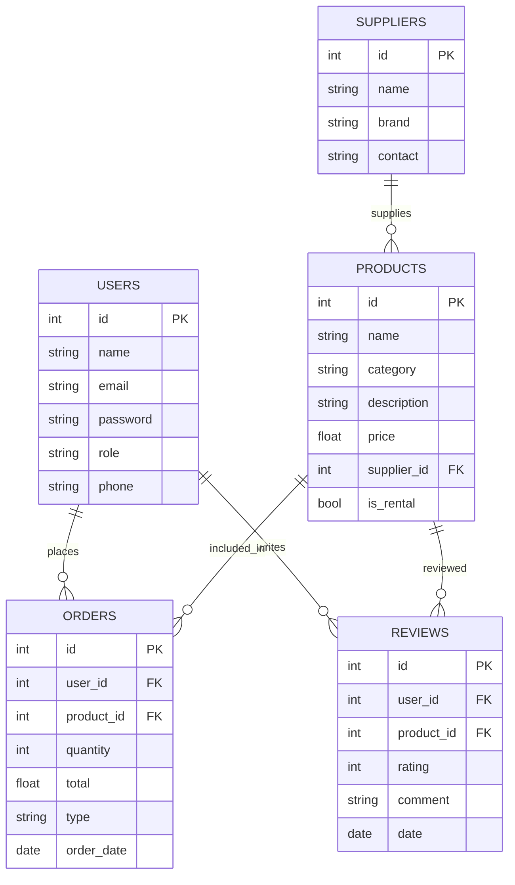

# Thangam Client – Complete Documentation

## Project Overview

**Thangam Client** is a web application designed for the rental and sales of gardening tools and fertilizers. It caters to home gardeners, landscaping businesses, and professionals who wish to buy or rent high-quality gardening equipment and agricultural inputs.

The project is built using **React** (bootstrapped with Create React App) and communicates with a backend API (not included in this client repository) to manage products, rentals, orders, users, suppliers, and reviews.

---

## Table of Contents

1. [Project Features](#project-features)
2. [Use Case Diagram](#use-case-diagram)
3. [Sequence Diagrams](#sequence-diagrams)
4. [ER Diagram](#er-diagram)
5. [Setup Instructions](#setup-instructions)
6. [Application Structure](#application-structure)
7. [Key Pages and Components](#key-pages-and-components)

---

## Project Features

- **Product Catalog**: Browse gardening tools and fertilizers, available for sale or rent.
- **Rental Management**: Staff and admins can add, update, and manage rental products.
- **Order Management**: Users can place orders for purchase or rental; staff/admins can manage these.
- **Supplier Management**: Add and update supplier details for inventory tracking.
- **User Management**: Authentication, role-based access (admin, staff, user), and profile management.
- **Reviews**: Users can review products; admins can moderate reviews.
- **Dashboard**: Role-based dashboards for staff and admins to view statistics and manage inventory.
- **Search**: Live product search with suggestions.
- **Responsive UI**: Modern, responsive interface with clear navigation.

---

## Use Case Diagram



---

## Sequence Diagrams

### Sequence: User Places a Rental Order



---

## ER Diagram



---

## Setup Instructions

1. **Clone the repository:**
   ```bash
   git clone https://github.com/Mathura-skr/Thangam-Client.git
   cd Thangam-Client
   ```

2. **Install dependencies:**
   ```bash
   npm install
   ```

3. **Start the development server:**
   ```bash
   npm start
   ```
   The app will run at `http://localhost:3000/`.

4. **Build for production:**
   ```bash
   npm run build
   ```

5. **Run tests:**
   ```bash
   npm test
   ```

> **Note:** This is a client-only repository. Ensure the backend API is running and the API endpoints are correctly configured in the project.

---

## Application Structure

- `src/components/`: Reusable UI components (e.g., Navigation)
- `src/pages/`: Main pages (Home, About Us, Staff/Admin dashboards, Product lists)
- `src/Routes/`: Routing configuration
- `src/context/`: Authentication context
- `src/assets/`: Static images and assets

Example route imports (from `src/Routes/RouteLayout.jsx`):

- `/admin/*` — Admin functions (products, rentals, sales, reviews)
- `/staff/*` — Staff functions (products, rentals, suppliers)
- `/` — Public pages (Home, About, Product catalog, etc.)

---

## Key Pages and Components

- **Home Page (`src/pages/home/HomePage.jsx`)**: Promotional hero, quick actions, and navigation to main features.
- **About Us (`src/pages/AboutUs/Aboutus.jsx`)**: Overview of company and mission.
- **Product Management (`src/pages/Staff/NewProduct.jsx`, `src/pages/Staff/NewRentalProduct.jsx`)**: Forms for staff to add new products or rental items, fetching suppliers dynamically.
- **User Authentication and Context (`src/context/authContext.js`)**: Handles user login, logout, and role management.
- **Navigation Bar (`src/components/Navbar/Navigation.jsx`)**: Responsive nav with live search and user context.

---
